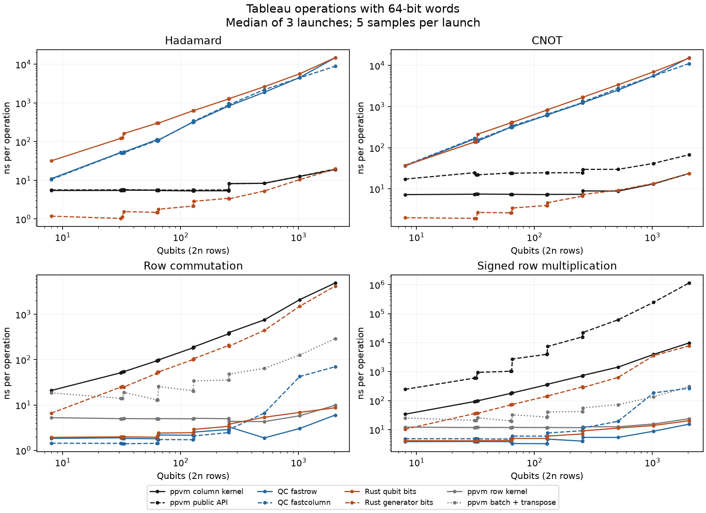
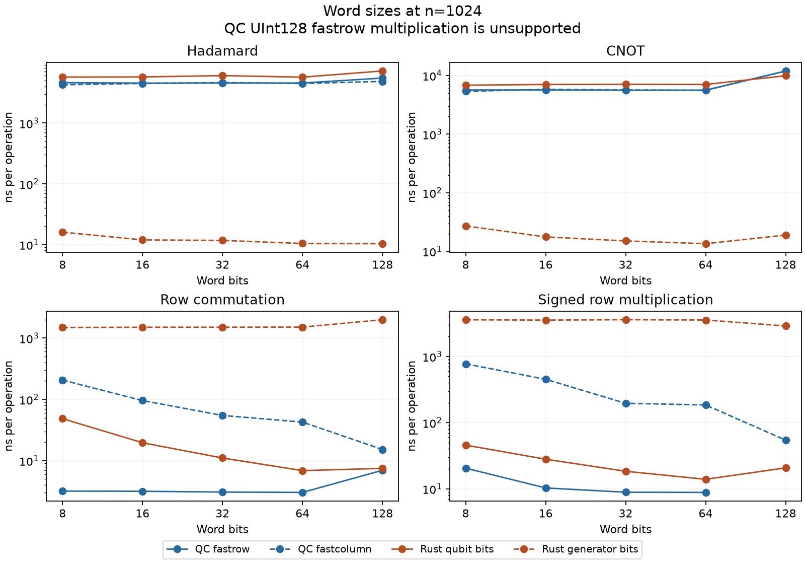

# Padded tableau storage: ppvm PR 204 and QuantumClifford

## Current storage

**PR 204 already implements the requested padding optimization.** This study
uses ppvm commit `3befaf1b597033138d6c1bab394b967b09cd57fb`, not the legacy
tableau crate. No production storage replacement was needed to add padding.

[`TableauData`](https://github.com/QuEraComputing/ppvm/blob/3befaf1b597033138d6c1bab394b967b09cd57fb/crates/ppvm-tableau-2/src/storage/mod.rs#L147)
owns a `Vec<Block>`, where `Block` contains four `u64` words and has 32-byte
alignment. The logical X and Z matrices each have 2n generators and n qubits.
They are divided into four square n-by-n quadrants: destabilizer X/Z and
stabilizer X/Z. The arena also holds two packed phase bits per generator
and a reserved loss plane. Inverse signs and scratch have additional allocations;
the entire `TableauData` is not a single allocation.

For positive n, each major has

```text
stride = 4 * ceil(n / 256) u64 words
arena bytes = 8 * (4n + 5) * stride
```

Each row or column therefore starts at a **256-bit boundary**, not merely a
64-bit boundary. Unused words and tail bits stay zero. Gate kernels perform
whole-word Boolean operations on contiguous slices; there is no shift to
repair a misaligned row boundary. Words are fixed at `u64`.

The canonical column layout packs **generators** inside each word for a fixed
qubit. A gate updates 64 generators per word operation. Row operations use
either a strided gather or a physical bit transpose of the four quadrants.
The private transpose guard restores column orientation when it exits.
See [word kernels](https://github.com/QuEraComputing/ppvm/blob/3befaf1b597033138d6c1bab394b967b09cd57fb/crates/ppvm-tableau-2/src/storage/blocks.rs)
and [transposition](https://github.com/QuEraComputing/ppvm/blob/3befaf1b597033138d6c1bab394b967b09cd57fb/crates/ppvm-tableau-2/src/storage/transpose.rs).

## What QuantumClifford does differently

At QuantumClifford commit `1e553b25fdf12c67b55ccedfbc2f48f4dea78fcc`,
[`Tableau.xzs`](https://github.com/QuantumSavory/QuantumClifford.jl/blob/1e553b25fdf12c67b55ccedfbc2f48f4dea78fcc/src/QuantumClifford.jl#L150)
has logical word-matrix shape `(2 * ceil(n/B), r)` for word width B and r rows.
Each row's X and Z halves are separately padded to a whole word. Phases are
stored in a separate `UInt8` vector.

[`fastrow`](https://github.com/QuantumSavory/QuantumClifford.jl/blob/1e553b25fdf12c67b55ccedfbc2f48f4dea78fcc/src/fastmemlayout.jl)
makes all words of one generator contiguous. `fastcolumn` makes the same word
position in consecutive generators contiguous. It transposes the **word
matrix**, not the bits within those words. Both layouts still pack adjacent
qubits into each word. Consequently, QuantumClifford `fastcolumn` is not the
same layout as ppvm's canonical columns.

For `m = ceil(n/B)`, the zero-based offsets make the distinction explicit:

```text
QC fastrow:    word = row*(2m) + plane*m + qubit/B; bit = qubit%B
QC fastcolumn: word = (plane*m + qubit/B)*(2n) + row; bit = qubit%B
ppvm column:  word = (half*2+plane)*n*stride + qubit*stride + generator/64
              bit = generator%64  (generator is local to its n-row half)
```

The [bitpack tests](https://github.com/QuantumSavory/QuantumClifford.jl/blob/1e553b25fdf12c67b55ccedfbc2f48f4dea78fcc/test/test_bitpack.jl)
cover different word types and memory orders. This harness constructs each
word type directly so the padding is really `ceil(n/B)`, rather than preserving
64-bit padding by reinterpreting an existing allocation.

X/Z payload bytes, excluding phases, caches, scratch and container metadata:

| n | ppvm | QC UInt64, either layout | Rust qubit bits, u64 | Rust generator bits, u64 |
|---:|---:|---:|---:|---:|
| 8 | 1,024 | 256 | 256 | 128 |
| 65 | 8,320 | 4,160 | 4,160 | 3,120 |
| 257 | 65,792 | 41,120 | 41,120 | 37,008 |
| 1,024 | 524,288 | 524,288 | 524,288 | 524,288 |

The respective formulas are `128n*ceil(n/256)`, `32n*ceil(n/64)`
and `16n*ceil(2n/64)` bytes. The Rust generator-packed experiment pads all
2n generators together instead of padding each n-row half independently.

## Experiment and limits

The [harness](README.md) measures actual ppvm storage kernels, the actual public
ppvm API, actual QuantumClifford, and a separate generic Rust storage experiment.
The experiment uses word-boundary padding, both bit packing axes, and words
of 8, 16, 32, 64 and 128 bits. It is not an integrated simulator replacement.

All implementations process 2n rows. Timed operations are row commutation,
signed row multiplication, H, S, CNOT, and a 3n-gate Clifford sequence. The
sequence is not dense Clifford matrix multiplication. ppvm's physical
transpose round trip is measured separately. Copying initial inputs,
compilation, and result checks are outside the timer; conversion is included
only in explicitly named conversion/batch cases.

These are warm repeated sweeps. Each sample starts from the same fixture and
then evolves it through repeated sweeps. The timed valid frames' adjacent
rows commute. A separate arbitrary-input pass covers anticommutation and
odd complex phases. Every logical bit and phase contributes to a digest
checked against a Python reference; missing or duplicated configurations
fail the harness.

Cross-library timings include algorithm differences. Native ppvm row multiplication
copies source words into reusable scratch, while the candidate and QuantumClifford
borrow the source. Native row commutation uses two population-count reductions;
the others reduce XORs first. Public ppvm gates also maintain inverse signs and
invalidate the hash cache. These are not padding-only comparisons.

QuantumClifford also has a different multiplication phase algorithm: it keeps
two packed counters modulo four and delays population counts until after the
word/vector loop. ppvm's current kernel counts two masks inside each word
iteration. This is a possible optimization of ppvm's existing slices, independent
of the storage layout; this study does not isolate its contribution.
See [ppvm's phase loop](https://github.com/QuEraComputing/ppvm/blob/3befaf1b597033138d6c1bab394b967b09cd57fb/crates/ppvm-tableau-2/src/storage/blocks.rs#L181)
and [QuantumClifford's counter and SIMD kernels](https://github.com/QuantumSavory/QuantumClifford.jl/blob/1e553b25fdf12c67b55ccedfbc2f48f4dea78fcc/src/mul_leftright.jl#L11).

QuantumClifford's `UInt128`/`fastrow` signed multiplication is unsupported:
SIMD.jl rejects `UInt128` vector lanes. Its other tested `UInt128` operations,
including `fastcolumn` multiplication, work. Word width and SIMD vector width
are separate properties. Inspection of the measured arm64 binaries found NEON
128-bit Boolean instructions in ppvm's `u64` H/CNOT kernels and the candidate's
`u64` CNOT specialization, alongside scalar fallback paths. The candidate's
`u128` CNOT specialization instead uses paired 64-bit scalar registers in this
build. Padding permits vectorization; the compiler and loop length determine
which instructions execute.

## Measurements

Measured on an Apple M5 Pro, macOS 26.6.2 arm64, Rust 1.96.0/LLVM 22.1.6
and Julia 1.12.6. Rust release builds used `-C target-cpu=native`; Julia
used its native CPU target and one thread. Sixteen sizes from 8 to 2048
qubits include the word and 256-bit padding boundaries. Each configuration
has five samples in each of three process launches, with a target minimum
batch time of 10 ms. The table reports the median of the three launch medians.
Launches ran sequentially after builds and tests completed.

**All 32,400 measurements passed the logical-result and coverage checks.**
The separate arbitrary-input pass validated 1,170 cases. This is one machine
and a warm-sweep workload, not a general simulator performance ranking.

At **n = 1024**, times are **ns per row operation or gate**:

| Operation | ppvm native kernel | ppvm public API | Best QC configuration | Best Rust candidate |
|---|---:|---:|---:|---:|
| Commutation | 5.79 | — | 3.03 | 6.87 |
| Signed row multiplication | 15.62 | 246,822 | 8.80 | 13.89 |
| H | 12.70 | 12.70 | 4,268 | 10.35 |
| S | 8.84 | 26.39 | 4,103 | 7.74 |
| CNOT | 13.15 | 41.55 | 5,358 | 13.50 |
| Clifford sequence, per gate | 11.37 | 26.91 | 4,604 | 10.03 |

Native row kernels are already in row orientation; gate kernels use columns.
QC's best row configurations here are `UInt64/fastrow`, and its best gate
configurations are `UInt8/fastcolumn`. The candidate uses qubit-packed `u64`
for rows, generator-packed `u64` for S/CNOT/the sequence, and generator-packed
`u128` for H. **Best** means a separate choice for each operation, not one
backend configuration winning all operations.

Across the three launches, public ppvm CNOT medians range from 41.30 to
41.94 ns; the selected QC CNOT ranges from 5,329 to 5,617 ns. QC's row-multiply
medians range from 8.70 to 8.94 ns versus native ppvm's 15.56 to 15.73 ns.
Thus the measured gate gap is large, while the row-kernel gain is about 1.8×.
At this size both libraries' X/Z data occupy 512 KiB, so the latter difference
cannot be attributed to less padding alone.



The figure fixes word width at 64 bits so each curve denotes one configuration.
The table above also considers all the other tested widths.

### Conversion cost dominates individual public row calls

ppvm's public `row_multiply` allocates scratch and performs a full transpose
pair on every call. The benchmark's internal batch shares one transpose pair
and reuses scratch across 2n row multiplications.

| n | Already-row-major kernel, ns/row | Batch including conversion, ns/row | Public API, ns/row | Full transpose round trip, ns |
|---:|---:|---:|---:|---:|
| 8 | 12.22 | 25.24 | 245 | 215 |
| 65 | 11.93 | 32.51 | 2,738 | 2,644 |
| 257 | 12.54 | 56.33 | 22,346 | 22,382 |
| 1024 | 15.62 | 135.65 | 246,822 | 246,244 |
| 2048 | 23.81 | 306.14 | 1,148,053 | 1,156,961 |

At n=1024, the public call is about 1,820× slower per row than the internal
batch in this workload. This is evidence for an API/batching improvement,
not a shipped speedup or a claim about every measurement path. Several existing
internal measurement paths already batch their row work. The direct column
gather/multiply/scatter case takes 3,933 ns per row at this size, which also
shows why isolated row access need not pay a full-tableau transpose.

### Word width and padding



The compact Rust candidate improves the small-tableau kernels: at n=8 the
best tested H and CNOT configurations take 1.07 and 1.69 ns versus native
ppvm's 5.46 and 7.22 ns. At n=65 they take 1.70 and 2.98 ns versus 5.45 and
7.32 ns. This supports investigating tighter padding and simpler small-tableau
kernels. It does not isolate padding from quadrant splitting, slice setup,
phase access or the different kernel implementations.

At n=2048, candidate `u64` gate times are close to native ppvm: H 19.73 versus
18.90 ns, S 14.75 versus 14.94 ns, CNOT 23.67 versus 23.61 ns, and the sequence
16.72 versus 17.13 ns per gate. The candidate's best configuration for all six
operations at this size uses `u64`. `u128` has occasional small/boundary-size
wins, but provides no general advantage.

QuantumClifford favors `UInt32`/`UInt64` contiguous rows for large row operations
and `UInt8/fastcolumn` for the large gate sweeps. At n=2048, its best row
multiply takes 15.41 ns; the best CNOT takes 10,725 ns versus ppvm's public
67.66 ns. Small differences between 32- and 64-bit winners should not be treated
as a universal tuning rule. The full per-launch and per-sample ranges are in
[summary.csv](results/summary.csv).
The UInt8 gate advantage over UInt64 is often only 4–5% and sometimes lies
within launch variation. At n=2048, UInt32 and UInt64 row multiplication differ
by only 0.4%. These results support keeping `u64` as a practical default.
At n=8, QC's best S gate (8.84 ns) also beats ppvm's public S (10.51 ns);
the large-tableau gate results should not be extended to every small case.

## Recommendation

1. **Keep the current generator-packed columns for gate-heavy workloads.**
   They already supply the requested padding and word broadcasting. Switching
   wholesale to QuantumClifford's word-matrix layout is not supported by these
   gate measurements.
2. **Amortize row conversion before replacing storage.** A public row-batch
   interface or a longer-lived orientation guard with reusable scratch is the
   clearest opportunity shown here. Use direct gathers for small row workloads
   where a complete transpose costs more than the row operations.
3. **Evaluate QuantumClifford's row phase kernel independently.** Its deferred
   population counts and explicit SIMD can be tested over the existing padded
   slices, preserving ppvm's gate layout and inverse-tableau machinery.
4. **Treat compact padding as a small-tableau experiment.** The prototype's
   gains justify a focused production A/B test of stride/alignment and quadrant
   overhead, followed by measurement and mixed gate/row workloads. These
   microbenchmarks do not establish a safe replacement for the full simulator.

Production code remains unchanged. The deliverable is the runnable comparison,
validated prototype, raw measurements, figures and this report.

## Reproduction and checks

See [README.md](README.md) for the one-command harness. Recorded provenance is
in [metadata.json](results/metadata.json), including the clean measured harness
commit, compiler flags and executable hashes. The Julia [Project](results/Project.toml)
and [Manifest](results/Manifest.toml) retain dependency versions. Compressed raw
samples are split into [native](results/native-samples.csv.gz),
[candidate](results/candidate-samples.csv.gz) and
[QuantumClifford](results/quantumclifford-samples.csv.gz) files.
The [unsupported-case record](results/unsupported.json) covers UInt128 SIMD
multiplication. SVG versions of both figures are included for reuse.

Validation completed: `cargo test --workspace` (1,938 passed, three ignored),
focused tableau tests, the candidate's boundary/algebra test, Clippy with
warnings denied, Rust formatting, Python lint/format checks, and all harness
checks described above. This study does not measure cold-cache behavior,
measurement throughput, allocation-inclusive construction, or dense Clifford
matrix multiplication.

The [first upstream CI run](https://github.com/QuEraComputing/ppvm/actions/runs/36100129473/job/107960648870)
stopped at Clippy 1.98's `chunks_exact_to_as_chunks` lint in unchanged
`crates/stim-parser/src/pipeline/lower.rs:440`. The local Clippy checks above
use Rust 1.96.0. This study leaves that unrelated parser code unchanged.
